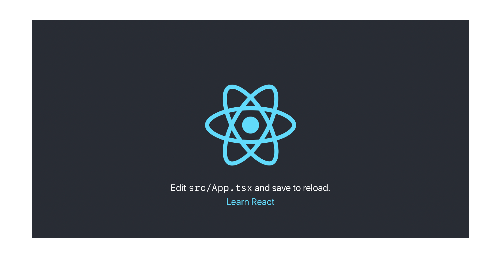

# CRA

 

Minimal React starter for CRA TypeScript projects. This project was bootstrapped with [Create React App](https://github.com/facebook/create-react-app) and contains the following additions:

- [Typescript](https://www.typescriptlang.org)
- [Tailwindcss](https://tailwindcss.com)
- [Eslint](https://eslint.org)
- [Husky](https://github.com/typicode/husky)
- [Lint-staged](https://github.com/okonet/lint-staged)

## Available Scripts

In the project directory, you can run:

### `yarn start`

Runs the app in the development mode.\
Open [http://localhost:3000](http://localhost:3000) to view it in the browser.

The page will reload if you make edits.\
You will also see any lint errors in the console.

### `yarn build`

Builds the app for production to the `build` folder.\
It correctly bundles React in production mode and optimizes the build for the best performance.

The build is minified and the filenames include the hashes.\

See the section about [deployment](https://facebook.github.io/create-react-app/docs/deployment) for more information.

### `yarn format`

Prettier format files.

### `yarn type-check`

Type checks your code.

### `yarn pre-build`

Check the code quality before building the app for production.

## Learn More

You can learn more in the [Create React App documentation](https://facebook.github.io/create-react-app/docs/getting-started).

To learn React, check out the [React documentation](https://reactjs.org/).
